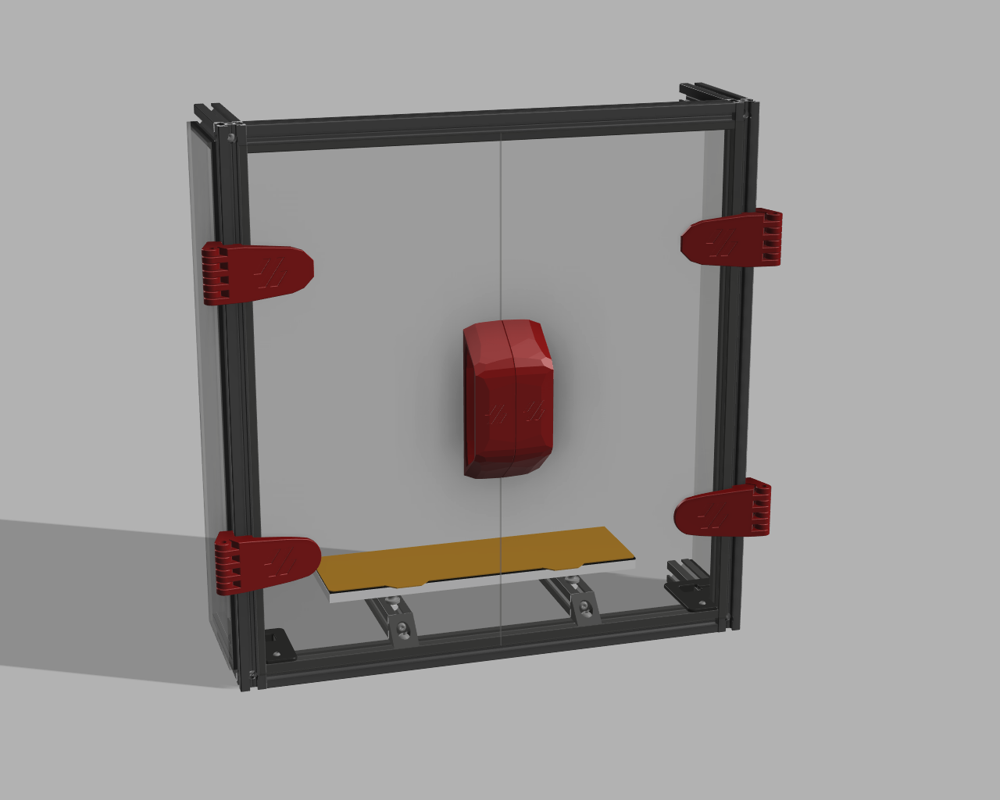
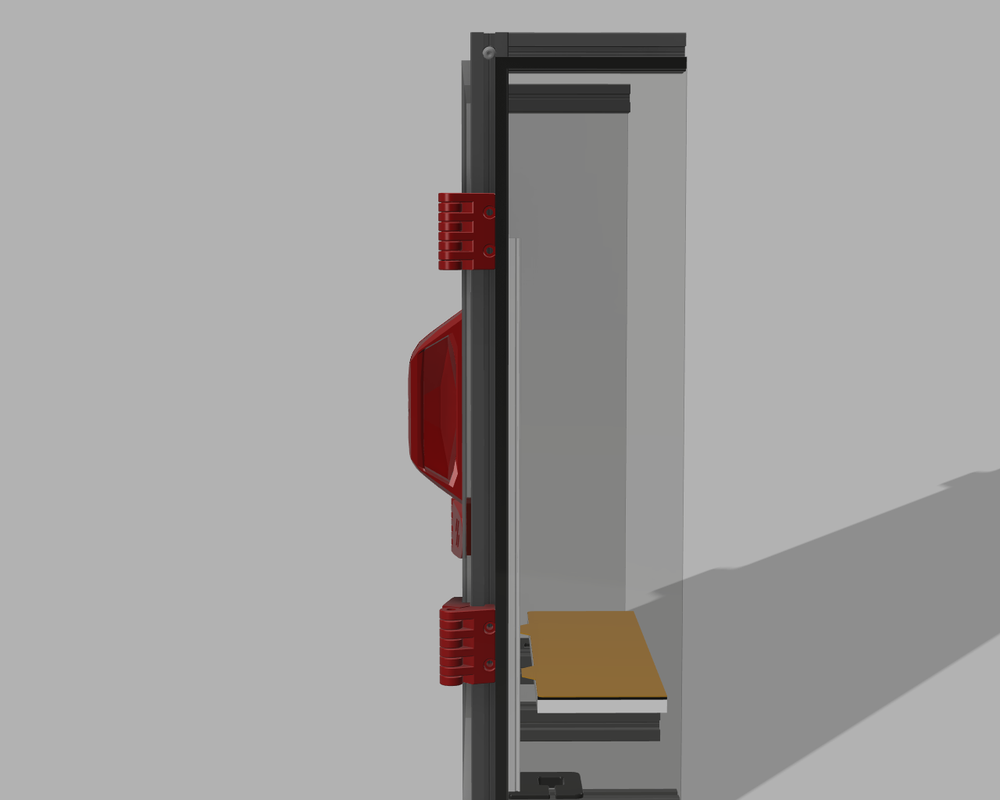
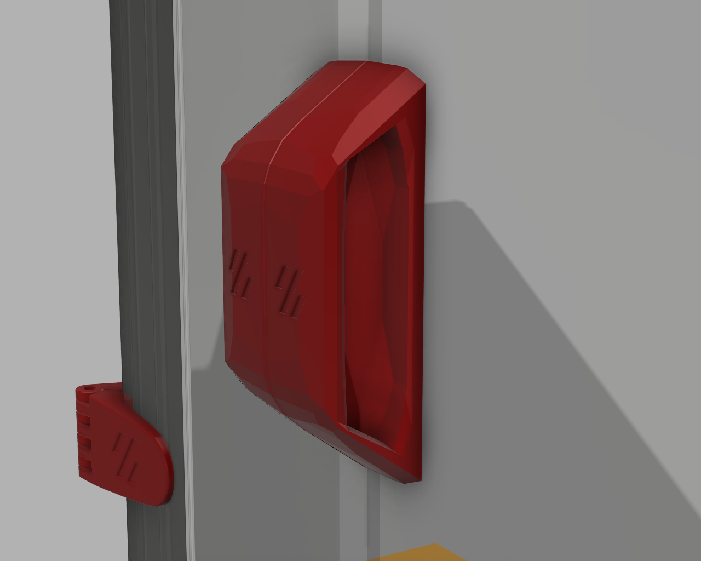
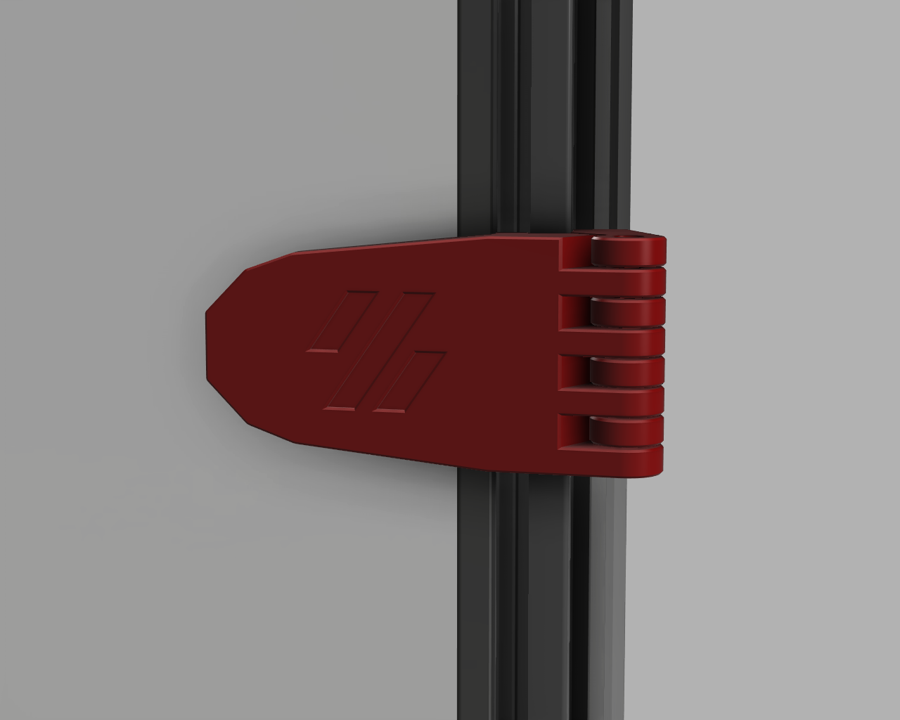
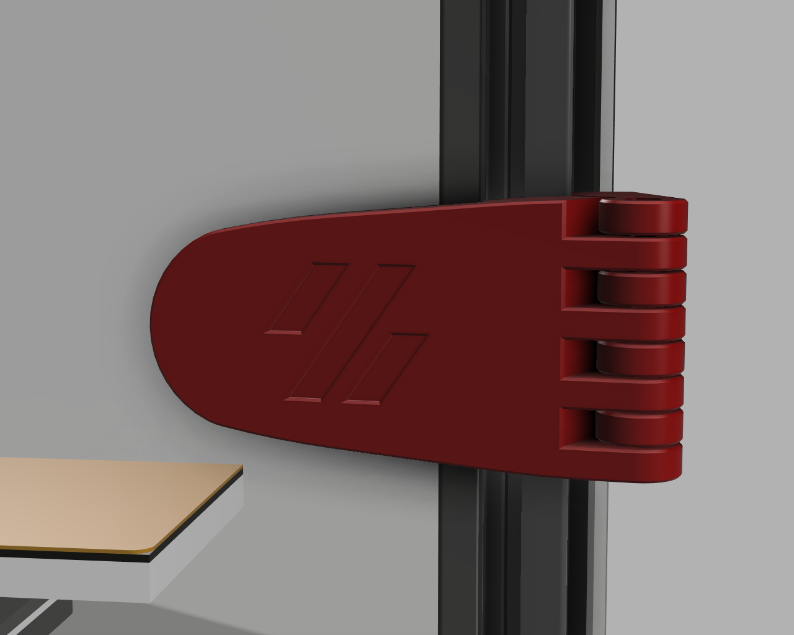

# Voron-Beefy-Hinges-Handles

### This is in Beta, please provide feedback!

### Handles

### Stealth/Sharp/Voron stlye hinges

### Rounded hinges

### What is this?

I was tired of having very flimsy thin hinges that may break, but I also didn't wanned to spend my money on a clicky clacky door, so I designed thse extreamly beefy Hinges + a very beefy pair of handles that
wouldn't break.

#### Changes compared to stock hinges:
- They WILL NOT BREAK
- They have a MUCH Bigger surface contact area for VHB tape so that it doesn't come off
- You will have a better seal since you need to use a 1mm foam tape

## BOM

### Hinges
- 4× M5×40 SHCS (It doesn't matter what head you use since you just use them as axles)
- 8× M3x8 SHCS
- 8x M3 Hammer head t-nut
- 8x 6x3mm magnets (6mm diameter 3mm thick)
- 1mm VHB tape

### Handles
- 4x 6x3mm magnets (6mm diameter 3mm thick)
- 1mm VHB tape

# Contributors
Non so far, however, if you provide feedback your name will be here

And If someone has any suggestion for improving the design or maybe some cool features I could add, please don't hesitate to tell me.

You can either contact me through Github or through Discord "radiotbo" (I'd probably answer you faster through discord)
